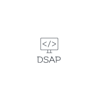

<!-- Improved compatibility of back to top link: See: https://github.com/othneildrew/Best-README-Template/pull/73 -->
<a name="readme-top"></a>
<!--
*** Thanks for checking out the Best-README-Template. If you have a suggestion
*** that would make this better, please fork the repo and create a pull request
*** or simply open an issue with the tag "enhancement".
*** Don't forget to give the project a star!
*** Thanks again! Now go create something AMAZING! :D
-->


<!-- PROJECT SHIELDS -->
<!--
*** I'm using markdown "reference style" links for readability.
*** Reference links are enclosed in brackets [ ] instead of parentheses ( ).
*** See the bottom of this document for the declaration of the reference variables
*** for contributors-url, forks-url, etc. This is an optional, concise syntax you may use.
*** https://www.markdownguide.org/basic-syntax/#reference-style-links
-->
[![Contributors][contributors-shield]][contributors-url]
[![Forks][forks-shield]][forks-url]
[![Stargazers][stars-shield]][stars-url]
[![Issues][issues-shield]][issues-url]
[![MIT License][license-shield]][license-url]


<!-- PROJECT LOGO -->
<br />
<div align="center">
  <a href="https://github.com/Hex09AF/cp-practice">
    
  </a>

<h3 align="center">CP Practice</h3>

  <p align="center">
    Practice competitive programming
    <br />
    <a href="https://github.com/Hex09AF/cp-practice/issues">Report Bug</a>
    ·
    <a href="https://github.com/Hex09AF/cp-practice/issues">Request Feature</a>
  </p>
</div>


<!-- TABLE OF CONTENTS -->
<details>
  <summary>Table of Contents</summary>
  <ol>
    <li>
      <a href="#about-the-project">About The Project</a>
      <ul>
        <li><a href="#made-with">Made With</a></li>
      </ul>
    </li>
    <li>
      <a href="#getting-started">Getting Started</a>
      <ul>
        <li><a href="#prerequisites">Prerequisites</a></li>
        <li><a href="#installation">Installation</a></li>
      </ul>
    </li>
    <li><a href="#contributing">Contributing</a></li>
    <li><a href="#license">License</a></li>
    <li><a href="#contact">Contact</a></li>
    <li><a href="#acknowledgments">Acknowledgments</a></li>
  </ol>
</details>

<br />

<!-- ABOUT THE PROJECT -->
## About The Project

Resources for practice competitive programming

<p align="right">(<a href="#readme-top">back to top</a>)</p>


### Made With

* [![Cplusplus][Cplusplus]][Cplusplus-url]

<p align="right">(<a href="#readme-top">back to top</a>)</p>


<!-- GETTING STARTED -->
## Getting Started

To get a local copy up and running follow these simple steps.

### Prerequisites

Friendly with Codeforces, leetcode, topcoder.

### Installation

1. have knowledge of C++, data structure, algorithm.

2. Clone the repo
   ```sh
   git clone https://github.com/Hex09AF/cp-practice.git
   ```

<p align="right">(<a href="#readme-top">back to top</a>)</p>

<!-- CONTRIBUTING -->
## Contributing

Contributions are what make the open source community such an amazing place to learn, inspire, and create. Any contributions you make are **greatly appreciated**.

If you have a suggestion that would make this better, please fork the repo and create a pull request. You can also simply open an issue with the tag "enhancement".
Don't forget to give the project a star! Thanks again!

1. Fork the Project
2. Create your Feature Branch (`git checkout -b feature/short-problem-name`)
3. Commit your Changes (`git commit -m 'Implement problem-name'`)
4. Push to the Branch (`git push origin feature/short-problem-name`)
5. Open a Pull Request

<p align="right">(<a href="#readme-top">back to top</a>)</p>


<!-- LICENSE -->
## License

Distributed under the MIT License. See `LICENSE.txt` for more information.

<p align="right">(<a href="#readme-top">back to top</a>)</p>


<!-- CONTACT -->
## Contact

Hex - [@Hex](https://codeforces.com/profile/Huyz) - lsqhuy@gmail.com

Project Link: [https://github.com/Hex09AF/cp-practice](https://github.com/Hex09AF/cp-practice)

<p align="right">(<a href="#readme-top">back to top</a>)</p>


<!-- ACKNOWLEDGMENTS -->
## Acknowledgments

* [Codeforces](https://codeforces.com/edu/courses)
* [Leetcode](https://leetcode.com/)
* [Atcoder](https://atcoder.jp/)
* [Topcoder](https://www.topcoder.com/)
* [Usaco guide](https://usaco.guide/dashboard/)

<p align="right">(<a href="#readme-top">back to top</a>)</p>


<!-- MARKDOWN LINKS & IMAGES -->
<!-- https://www.markdownguide.org/basic-syntax/#reference-style-links -->
[contributors-shield]: https://img.shields.io/github/contributors/Hex09AF/cp-practice.svg?style=for-the-badge
[contributors-url]: https://github.com/Hex09AF/cp-practice/graphs/contributors
[forks-shield]: https://img.shields.io/github/forks/Hex09AF/cp-practice.svg?style=for-the-badge
[forks-url]: https://github.com/Hex09AF/cp-practice/network/members
[stars-shield]: https://img.shields.io/github/stars/Hex09AF/cp-practice.svg?style=for-the-badge
[stars-url]: https://github.com/Hex09AF/cp-practice/stargazers
[issues-shield]: https://img.shields.io/github/issues/Hex09AF/cp-practice.svg?style=for-the-badge
[issues-url]: https://github.com/Hex09AF/cp-practice/issues
[license-shield]: https://img.shields.io/github/license/Hex09AF/cp-practice.svg?style=for-the-badge
[license-url]: https://github.com/Hex09AF/cp-practice/blob/master/LICENSE.txt
[Cplusplus]: https://img.shields.io/badge/C++-blue.svg?style=for-the-badge&logo=c%2B%2B
[Cplusplus-url]: https://en.cppreference.com/w/cpp